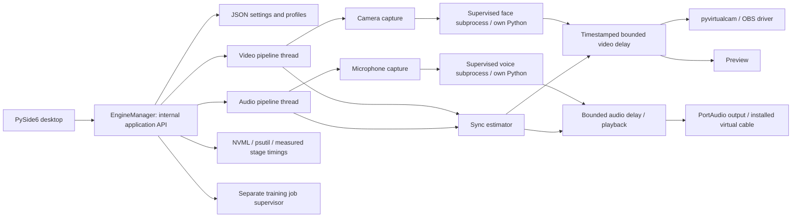

# Unified Live architecture

Design decision, 2026-10-02. Product name is configured in `Settings.app_name`.
This is an original desktop host, not a merger of upstream repositories.

## Boundaries and integration

- UI only calls `EngineManager`. The manager is a Python application API without
  Qt dependencies; a future CLI or authenticated remote frontend can wrap it.
- Each pipeline has its own bounded work queue and supervisor. Turning an effect
  off bypasses inference, without restarting capture or the other pipeline.
  Failure policy is explicit: preserve the other pipeline; expose the failure,
  and use a visible local passthrough until restart. Virtual outputs default off.
- Backends are children started with their configured Python executable and
  working directory. Core does not import Torch, TensorRT, RVC, or Seed-VC.
- IPC v1 uses private subprocess stdin/stdout, length-prefixed JSON metadata and
  raw contiguous array bytes (RGB/BGR `uint8` video, mono `float32` audio). No
  network listener, no pickle, no shared dependency environment. Messages have
  sequence IDs, size limits, shape/dtype validation, and timeouts. One in-flight
  request per backend bounds memory. Stdout is protocol-only; diagnostics use
  stderr and separate rotating logs.
- Shared memory is a later transport optimization behind the same contracts;
  do not implement GPU interoperability before profiling actual transfers.
- Stable face/voice contracts expose initialization, start/stop, source/model
  loading, processing, measured inference latency and explicit capabilities.
  Registry metadata distinguishes installed, available, configured and validated.
  Unimplemented adapters are listed as planned, never reported as working.

## Timing and synchronization

Use monotonic timestamps, bounded delay queues and independently measured capture,
inference and output stages. PortAudio timestamps/latency estimates supplement
host measurements. Consumer camera drivers rarely expose sensor timestamps;
capture call duration is a host estimate, not photon-to-display latency.
Measure baseline latency **before compensation** to avoid feedback oscillation.
Delay the faster stream by the difference; smooth estimates and bound the maximum
delay. Signed manual offsets are relative adjustments normalized to nonnegative
delays: the application cannot play samples before it receives them. Auto sync
operates only when both pipelines have valid samples; one stream works alone.
Queued media is scheduled against capture time, not delayed by repeated sleeps.
Changing profiles/devices clears stale timing and queued media. This synchronizes
host estimates; physical lip-sync needs a clap/loopback calibration on Windows.

## Upstream and license choices

New code: AGPL-3.0-only. External source, checkpoints, datasets and virtual device
drivers are separately installed and retain their licenses. Process separation
isolates dependencies; it is not an assertion that copyleft obligations disappear.
No automatic model download. See `docs/UPSTREAM_AUDIT.md` for source evidence.

ReSwapper can process arrays through its inference helpers but initializes
InsightFace at import. Its bridge must validate local models first and fail with
an actionable error rather than silently downloading weights. Seed-VC's realtime
GUI owns audio devices; invoking its file-conversion wrapper per chunk is not a
streaming integration. A bridge must retain context and crossfade state while the
core alone owns microphone/output. RVC is a model engine; w-okada is a separate
host adapter. Deep-Live-Cam has no assumed stable RPC contract.

## Dependency and resource risks

Python 3.11 is the initial supported Windows core interpreter. Core has PySide6,
NumPy, OpenCV, sounddevice, psutil, pynvml and pyvirtualcam; ML environments use
their own supported Python/Torch/ORT/CUDA versions. Two processes may duplicate
CUDA context/model memory even with 24 GB VRAM. Windows device drivers, sample
rates and exclusive device access must be tested on hardware. No universal
TensorRT/FP16 switch: expose only capabilities proven for a given backend.

## Persistence and safety

Versioned validated JSON, atomic file replacement, local model library and
human-readable profiles. User data lives outside the source tree by default;
`--data-dir` makes tests/portable runs explicit. No microphone/video recording
unless a future feature explicitly requests it. Logs contain operational events,
not raw biometric media. Model files may execute unsafe upstream deserialization;
use trusted sources. No backend is downloaded just because it appears in a list.

## Validation gates

Portable unit/IPC tests, separate subprocess crash/timeout tests, Qt offscreen
smoke test and measured synthetic benchmark run without an AI model. Camera,
microphone, OBS/VB-CABLE, NVIDIA telemetry and real inference are separate hardware
acceptance gates. A Linux headless test cannot establish Windows RTX performance.
