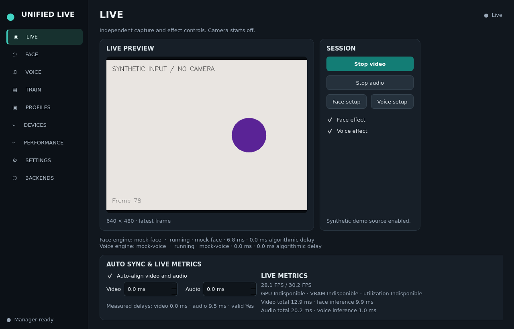
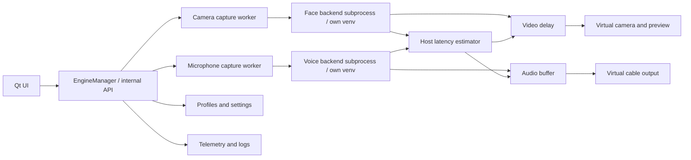

# Unified Live

A local desktop cockpit for interchangeable real-time face and voice engines.
Windows 11 and an NVIDIA RTX 4090 (24 GB) are the primary target. Quality,
stability and synchronization take priority over chasing the lowest latency.
The name is provisional and configurable through `app_name` in settings.

**Development status:** the model-free cockpit passes local Linux unit/process
tests and a real Qt smoke run. ReSwapper and Seed-VC have experimental external
bridges tested without model weights; their real CUDA inference is unvalidated.
The Windows 11 / RTX 4090 hardware acceptance gate remains open. RVC, training,
Deep-Live-Cam and w-okada follow the [roadmap](ROADMAP.md). A listed backend is
not a claim that its inference works on your hardware. See
[validation evidence and remaining gates](docs/VALIDATION.md).



This is a real offscreen Qt capture using synthetic inputs; GPU values are
unavailable on the development VM. It is not a Windows/RTX validation screenshot.

## What is Unified Live?

One native PySide6 application controls independently supervised video and audio
pipelines. The application owns physical and virtual devices; external engines
receive arrays through private IPC. Each engine can use its own Python, Torch,
ONNX Runtime and CUDA libraries. Upstream code and models are not merged into
the core or redistributed here.

## Features

- Dark desktop UI: LIVE, FACE, VOICE, TRAIN, PROFILES, DEVICES, PERFORMANCE,
  SETTINGS and BACKENDS.
- Independent camera and microphone sessions and Face/Voice ON/OFF bypass.
- CPU mock engines, synthetic demo sources and real camera preview.
- JSON profiles, configurable stream formats and advanced engine options.
- Bounded delay buffers, automatic compensation and signed manual offsets.
- NVIDIA NVML telemetry when available, CPU/RAM metrics and measured stage timing.
- Backend health checks, timeout, restart and separate logs.
- Optional OBS-compatible virtual video through pyvirtualcam and audio routing
  to an installed virtual cable through PortAudio/sounddevice.
- An actual measured benchmark CLI. No fabricated reference scores.

Mock face applies a visible color effect; mock voice applies gain. They do not
swap identity or synthesize a voice. TRAIN clearly marks future training actions
as unavailable until the independent RVC job runner is implemented.

## Architecture



See [ARCHITECTURE.md](ARCHITECTURE.md) for timing semantics, process boundaries,
failure policy, protocol and dependencies. Source layout:

```text
unified_live/
  __main__.py          python -m unified_live
  ui/                  PySide6 presentation, EngineManager calls only
  engine_manager/      registry orchestration, worker protocol and supervisor
  engines/             stable contracts, mock engines and external adapters
  media/               capture, inference scheduling and output buffers
  output/              virtual camera and audio abstractions
  sync/                latency calculator and compensation
  profiles/            versioned JSON presets
  settings/            validated atomic configuration
  telemetry/           NVML and psutil
training/rvc/          reserved for phase 5
config/                example settings
models/                local weights only, ignored by Git
runtime/               external environments/checkouts, ignored by Git
scripts/ tests/ docs/
```

## Installation

Install 64-bit **Python 3.11**, Git and current NVIDIA drivers on Windows 11.
The model-free core does not require CUDA, FFmpeg, OBS or a virtual audio driver.

```powershell
git clone https://github.com/KimyAI/unified-live.git
cd unified-live
powershell -ExecutionPolicy Bypass -File .\setup.ps1
.\.venv\Scripts\Activate.ps1
python -m unified_live
```

`setup.ps1` checks Windows, Python, GPU/driver, FFmpeg, OBS and virtual audio device
names. It creates only the core environment, then offers isolated backend venv
preparation. It does not download model weights or install device drivers.

Manual installation:

```powershell
py -3.11 -m venv .venv
.\.venv\Scripts\python -m pip install -e ".[dev]"
.\.venv\Scripts\python -m unified_live --demo
```

Select **Synthetic demo source** in SETTINGS or use `--demo`. Start video and
audio on LIVE, then enable the mock effects. Outputs stay off until explicitly
enabled. The synthetic audio monitor is silent unless routed to an output.

On Linux, use `python3 -m venv .venv` and `.venv/bin/python`; install distribution
Qt/OpenGL/PortAudio runtime libraries. Linux is useful for core development;
it does not establish Windows device compatibility.

## GPU requirements

The mock milestone runs on CPU. RTX 4090 24 GB is the design target for concurrent
AI inference, not a claim that every model combination fits. Separate processes
duplicate CUDA contexts; monitor total VRAM. A GPU supporting CUDA is required by
the initial Seed-VC realtime integration. Core does not globally install CUDA or
select one Torch version for every backend. Toolkit/runtime DLL requirements
depend on each backend's pinned Torch and ORT builds.

## Backend installation

Read the [upstream audit](docs/UPSTREAM_AUDIT.md) before installing code or models.
Keep one checkout and one venv per engine. Configure its executable, checkout and
bridge in SETTINGS; BACKENDS distinguishes installation/configuration from actual
validation. See [integration details](docs/BACKEND_INTEGRATION.md), the concrete
[ReSwapper setup](docs/RESWAPPER.md) and [Seed-VC setup](docs/SEED_VC.md).

An installation path alone does not validate a Python environment, a checkpoint,
a license, CUDA providers or real-time throughput. Startup must succeed before
the UI reports a running backend. Unsupported engines remain planned.

Never install all upstream `requirements.txt` files into the core environment.
ReSwapper, Seed-VC, RVC and DoppleDanger currently request different Torch/ORT/
NumPy builds, sometimes even mutually competing ORT distributions.

### Face engines

**ReSwapper** is first. Its external inference helpers operate on frames and can
be hosted without upstream UI/capture. Source image, swap checkpoint, detector
models and execution provider must be supplied explicitly. AGPL code does not
grant unrestricted use of InsightFace weights or `emap` derived from inswapper.

**Deep-Live-Cam** is planned as an external frame adapter, not a vendored fork.
The examined upstream revision uses globals and model-specific processing.
InSwapper, HyperSwap or ReSwapper support will be advertised only after verifying
that specific version; a model name is not an independent installed engine.

Enhancement, TensorRT and FP16 controls must follow backend capabilities. The
core does not make an unsupported feature work by displaying a checkbox.

### Voice engines

**Seed-VC realtime** is first. Its block inference requires persistent history,
reference conditioning and overlap handling. The offline file wrapper is not a
replacement for this streaming path. Diffusion steps/CFG/context/block settings
change both quality and latency and require real measurement.

**RVC** is a planned trained-model engine, with model/index/pitch/f0 settings.
**w-okada** is a separate planned adapter to a host that can run several engines;
it is not a synonym for RVC. Model licenses vary independently of the host.

## Training voices

Phase 5 will add prepare → preprocess → f0 → features → train → index → library.
Each long job runs outside Qt with cancellation, logs, elapsed time and VRAM.
The TRAIN page currently displays this scope and disables unavailable actions.
No training is performed or claimed by the first milestone.

## Virtual camera

Install OBS Studio separately so its virtual-camera driver is registered. Enable
virtual camera output on DEVICES, then select that camera in the consuming app.
pyvirtualcam writes frames to the installed backend; it does not install a driver.
Close other producers using the same OBS virtual camera; OBS and this app cannot
both own its producer at once. A failed virtual output leaves the local preview
running and reports an error. On Linux, pyvirtualcam generally needs v4l2loopback.

## Virtual microphone

Install VB-CABLE or VoiceMeeter separately. Select your **physical microphone** as
input and **CABLE Input** (the playback endpoint) as this app's audio output.
In Discord/OBS/etc., select **CABLE Output** as the microphone. Device names are
counterintuitive: this app writes to the playback side of the virtual cable.
Choose a supported common sample rate. Keep monitoring on speakers disabled to
avoid acoustic feedback. No virtual microphone driver is bundled.

## Sync

The estimator compares baseline video and audio stages **before compensation**.
If video is 55 ms and audio 145 ms, the requested video delay is 90 ms. These are
an explanatory example, not benchmark results. Auto Sync only operates when both
streams have valid measurements. Video-only and audio-only sessions remain valid.

Manual offsets adjust relative timing; negative offsets are normalized by delaying
the other stream, since received media cannot be played in the past. Queues are
bounded. Changing offsets can produce a frame drop or an audible gap; this initial
version does not use audio time stretching to conceal delay changes.

Displayed latency is a **host estimate**, not measured sensor-to-screen or
microphone-to-listener latency. OpenCV often cannot report camera sensor age,
and virtual drivers/consumer apps add latency after submission. PortAudio provides
capture/playback clock estimates. Use a clap/loopback test for physical calibration.

## Profiles and configuration

PROFILES saves a complete validated settings snapshot as JSON and restores it in
one action. Backend environments remain external. User data defaults to:

- Windows: `%LOCALAPPDATA%\UnifiedLive`
- Linux: `${XDG_DATA_HOME:-~/.local/share}/unified-live`

Use `python -m unified_live --data-dir .\data` for a portable installation.
Files include `settings.json`, `profiles/*.json` and `logs/*.log`. The repository
contains a [sample config](config/settings.json); copying it is optional.
Names reject path traversal, writes replace files atomically, and unknown fields
or unsupported schema versions are rejected instead of silently ignored.

QUALITY, BALANCED and LOW LATENCY are editable starting points; Advanced Mode
exposes backend options. Their values do not constitute measured engine rankings.

## Monitoring and benchmarks

PERFORMANCE displays real metrics or unavailable. GPU metrics use NVML; CPU and
RAM use psutil. Processing FPS and physical camera FPS are distinct.

```powershell
python -m unified_live --benchmark synthetic --iterations 100
python -m unified_live --benchmark face --benchmark-input authorized-target.png --iterations 100
python -m unified_live --benchmark voice --benchmark-input authorized-voice.wav --iterations 100
python -m unified_live --diagnose
```

Synthetic benchmarks execute actual mock workers and IPC. AI benchmarks require
an authorized target image or PCM16 WAV at the configured sample rate; ReSwapper
refuses a timing report if no target face is detected. Seed-VC's streaming warmup
is excluded before timing inference. Audio input is cycled in order (up to the
first 60 seconds). These measure throughput, not likeness or intelligibility.
Reports identify engine, host, warmup, sample format, mean and p95 roundtrip; no
VRAM value is substituted when it was not measured. Stop live capture first.

## Development and tests

```powershell
python -m pip install -e ".[dev]"
python -m pytest -q
python -m ruff check unified_live tests
python -m unified_live --demo --smoke-seconds 5
```

CI tests Windows and Linux. Headless Qt uses `QT_QPA_PLATFORM=offscreen`. The timed
smoke command opens the real Qt application, runs both mock subprocesses, checks
preview and audio progress, then closes. `--screenshot <file.png>` captures that
window; it is not an illustrated mockup. See [validation](docs/VALIDATION.md).

## Troubleshooting

- **Camera unavailable:** refresh devices, select the correct index, close apps
  holding exclusive access, and check Windows camera privacy permissions.
- **Audio not heard:** enable output explicitly, choose the cable's playback
  endpoint, match sample rates and select its recording endpoint in the receiver.
- **Backend failed:** inspect logs, confirm its venv/checkpoint/provider, then
  restart that backend. The other pipeline remains independent. Effect failure
  uses a visible passthrough fallback; this may expose your physical face/voice.
- **CUDA/ORT import failure:** repair that engine's venv; do not modify the core's
  dependencies to satisfy a backend. Check NVIDIA driver and DLL compatibility.
- **Growing audio drops:** inference exceeds the block budget. Increase block
  size/reduce steps or quality, and measure again. More buffering cannot fix a
  backend permanently slower than real time.
- **Unknown GPU:** NVML/driver absent or device index invalid; metrics stay
  unavailable. A mock test cannot establish RTX performance.
- **Qt startup on Linux:** install the distribution's EGL, xkbcommon and Qt XCB
  runtime dependencies; offscreen rendering still requires Qt's shared libraries.

Operational logs: `core.log`, `video-engine.log`, `voice-engine.log`, `training.log`
under the data directory. Worker stderr is separate. Logs do not intentionally
record raw audio/video; media is not saved during normal live operation.

## License

Original code in this repository is **AGPL-3.0-only**; see [LICENSE](LICENSE).
Dependencies, external engines, checkpoints, datasets and device drivers retain
their own licenses. Process isolation is an engineering choice and does not
automatically remove license obligations. See the source-linked
[license audit](docs/UPSTREAM_AUDIT.md) and [third-party notices](docs/THIRD_PARTY.md).

## Ethical / consent notice

Use only faces, voices, recordings and models you own or have explicit permission
to use. Do not impersonate someone without authorization, bypass identity checks,
mislead people about who is speaking, or use the application for fraud or harassment.
Disclose synthetic identity or voice effects when appropriate for your audience.
The software runs locally by design; this is not proof that every external backend
is offline. Models are opt-in and must be evaluated separately.
